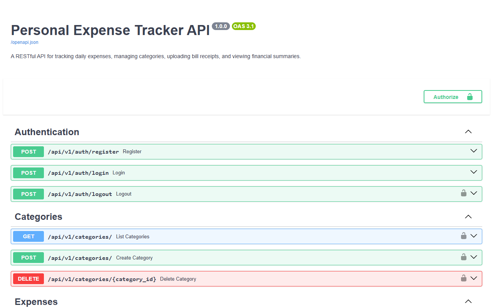
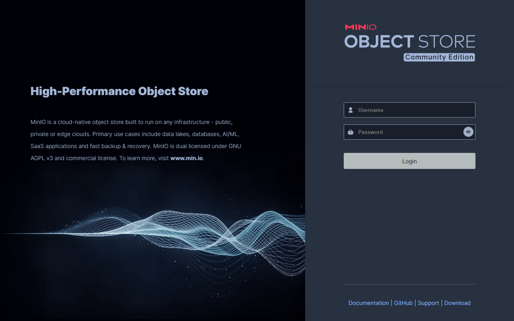

# 💰 Personal Expense Tracker API

A production-grade RESTful API for tracking daily expenses, managing categories, uploading bill receipts with signed URLs, and viewing financial summaries. Built with **FastAPI**, **PostgreSQL**, and **MinIO** (S3-compatible storage), fully containerized with **Docker Compose**.

## 🏗️ Architecture

```
┌─────────┐     ┌──────────────┐     ┌──────────────┐
│  Client  │────▶│  FastAPI API  │────▶│  PostgreSQL  │
│  (curl)  │     │   :8000      │     │    :5432     │
└─────────┘     └──────┬───────┘     └──────────────┘
                       │
                       ▼
                ┌──────────────┐
                │    MinIO     │
                │  :9000/:9001 │
                └──────────────┘
```

## 📸 Screenshots

### FastAPI Interactive Docs (Swagger UI)


### MinIO S3 Console


## ✨ Features

### Core
- **JWT Authentication** — Register, login, logout (token blacklisting)
- **Category Management** — Create, list, and delete expense categories
- **Expense Management** — Full CRUD with linked categories
- **Bill Image Upload** — Upload receipt images to S3/MinIO
- **Signed URLs** — Secure, time-limited URLs to view uploaded bills
- **Monthly Summary** — Category-wise spending breakdown

### Bonus
- **🎯 Budget Limits** — Set monthly budgets per category with over-budget warnings
- **🔍 Advanced Filtering** — Filter expenses by date range & category with pagination
- **📊 CSV Export** — Download monthly expenses as CSV files
- **💱 Currency Support** — Log expenses in different currencies with static conversion

## 🚀 Quick Start

### Prerequisites
- [Docker](https://docs.docker.com/get-docker/) & [Docker Compose](https://docs.docker.com/compose/install/)

### Run the Application

```bash
# Clone the repository
git clone <your-repo-url>
cd Foxo

# Start all services (API + PostgreSQL + MinIO)
docker-compose up --build
```

The API will be available at:
- **API**: http://localhost:8000
- **Swagger Docs**: http://localhost:8000/docs
- **MinIO Console**: http://localhost:9001 (login: `minioadmin`/`minioadmin`)

### Stop the Application

```bash
docker-compose down

# To also remove volumes (database & uploaded files):
docker-compose down -v
```

---

## 📚 Database Schema

```
┌──────────┐    ┌────────────┐    ┌──────────┐
│  users   │───▶│ categories │───▶│ expenses │
│          │    │            │    │          │
│ id (PK)  │    │ id (PK)    │    │ id (PK)  │
│ email    │    │ user_id FK │    │ user_id  │
│ username │    │ name       │    │ cat_id   │
│ password │    └────────────┘    │ amount   │
│ currency │         │           │ currency │
└──────────┘         ▼           │ desc     │
     │         ┌────────────┐    │ date     │
     │         │  budgets   │    │ bill_key │
     └────────▶│            │    └──────────┘
               │ id (PK)    │
               │ user_id FK │
               │ cat_id FK  │
               │ limit      │
               │ year/month │
               └────────────┘
```

---

## 🎮 How to Use the App (Swagger UI)

Since this API is secured with JWT authentication and enforces strict user data isolation, you must identify yourself before creating or viewing expenses. The easiest way to interact with the API is through the built-in Swagger UI.

### 1. Register a User
1. Open the Interactive Docs: [http://localhost:8000/docs](http://localhost:8000/docs)
2. Scroll to the **Auth** section and expand `POST /api/v1/auth/register`.
3. Click **Try it out**.
4. Modify the request body to include your details (email, username, password).
5. Click **Execute**. You should receive a `201` response confirming your account creation.

### 2. Login to get a Token
1. Expand the `POST /api/v1/auth/login` endpoint.
2. Click **Try it out**.
3. Enter the email and password you just registered with.
4. Click **Execute**. 
5. In the Server Response, look for the `access_token` field. **Copy that long string of text** (without quotes).

### 3. Authorize the UI
1. Scroll to the very top of the page.
2. Click the green **Authorize** button (or click any padlock icon next to an endpoint).
3. A popup will appear. **Paste the access token** you copied directly into the input field.
4. Click **Authorize** and then **Close**.

### 4. Test the Secure APIs!
Now that you are authorized, the Swagger UI will automatically attach your token to every request you make. 
- Try going to `POST /api/v1/categories/` and create a category (like "Groceries").
- Then try `POST /api/v1/expenses/` to log an expense using that category's ID.

*Note: The token will expire after 60 minutes, at which point you'll just need to use the login endpoint again to get a new one!*

---

## 🧪 API Testing with `curl`

> **Note:** Replace `YOUR_TOKEN` with the actual JWT token received from the login endpoint.

### 1. Health Check

```bash
curl -s http://localhost:8000/ | python -m json.tool
```

---

### 2. Authentication

#### Register a new user

```bash
curl -s -X POST http://localhost:8000/api/v1/auth/register \
  -H "Content-Type: application/json" \
  -d '{
    "email": "john@example.com",
    "username": "johndoe",
    "password": "secretpass123"
  }' | python -m json.tool
```

**Expected Response (201):**
```json
{
    "id": "a1b2c3d4-...",
    "email": "john@example.com",
    "username": "johndoe",
    "base_currency": "USD",
    "created_at": "2026-07-20T13:00:00+00:00"
}
```

#### Login

```bash
curl -s -X POST http://localhost:8000/api/v1/auth/login \
  -H "Content-Type: application/json" \
  -d '{
    "email": "john@example.com",
    "password": "secretpass123"
  }' | python -m json.tool
```

**Expected Response (200):**
```json
{
    "access_token": "eyJhbGciOiJIUzI1NiIs...",
    "token_type": "bearer",
    "user": {
        "id": "a1b2c3d4-...",
        "email": "john@example.com",
        "username": "johndoe",
        "base_currency": "USD",
        "created_at": "2026-07-20T13:00:00+00:00"
    }
}
```

> 💡 **Save the token:** `export TOKEN="eyJhbGciOi..."`

#### Logout

```bash
curl -s -X POST http://localhost:8000/api/v1/auth/logout \
  -H "Authorization: Bearer $TOKEN" | python -m json.tool
```

**Expected Response (200):**
```json
{
    "detail": "Successfully logged out."
}
```

---

### 3. Category Management

#### Create a category

```bash
curl -s -X POST http://localhost:8000/api/v1/categories/ \
  -H "Authorization: Bearer $TOKEN" \
  -H "Content-Type: application/json" \
  -d '{"name": "Groceries"}' | python -m json.tool
```

```bash
curl -s -X POST http://localhost:8000/api/v1/categories/ \
  -H "Authorization: Bearer $TOKEN" \
  -H "Content-Type: application/json" \
  -d '{"name": "Transport"}' | python -m json.tool
```

```bash
curl -s -X POST http://localhost:8000/api/v1/categories/ \
  -H "Authorization: Bearer $TOKEN" \
  -H "Content-Type: application/json" \
  -d '{"name": "Rent"}' | python -m json.tool
```

#### List all categories

```bash
curl -s http://localhost:8000/api/v1/categories/ \
  -H "Authorization: Bearer $TOKEN" | python -m json.tool
```

#### Delete a category

```bash
curl -s -X DELETE http://localhost:8000/api/v1/categories/CATEGORY_ID \
  -H "Authorization: Bearer $TOKEN" | python -m json.tool
```

---

### 4. Expense Management

#### Create an expense

```bash
curl -s -X POST http://localhost:8000/api/v1/expenses/ \
  -H "Authorization: Bearer $TOKEN" \
  -H "Content-Type: application/json" \
  -d '{
    "category_id": "CATEGORY_ID",
    "amount": 49.99,
    "currency": "USD",
    "description": "Weekly groceries from supermarket",
    "expense_date": "2026-07-20"
  }' | python -m json.tool
```

#### Create an expense in a different currency

```bash
curl -s -X POST http://localhost:8000/api/v1/expenses/ \
  -H "Authorization: Bearer $TOKEN" \
  -H "Content-Type: application/json" \
  -d '{
    "category_id": "CATEGORY_ID",
    "amount": 2000,
    "currency": "INR",
    "description": "Uber ride to airport",
    "expense_date": "2026-07-19"
  }' | python -m json.tool
```

#### List all expenses (with pagination)

```bash
curl -s "http://localhost:8000/api/v1/expenses/?limit=10&offset=0" \
  -H "Authorization: Bearer $TOKEN" | python -m json.tool
```

#### List expenses with filters

```bash
# Filter by date range
curl -s "http://localhost:8000/api/v1/expenses/?start_date=2026-07-01&end_date=2026-07-31" \
  -H "Authorization: Bearer $TOKEN" | python -m json.tool

# Filter by category
curl -s "http://localhost:8000/api/v1/expenses/?category_id=CATEGORY_ID" \
  -H "Authorization: Bearer $TOKEN" | python -m json.tool

# Combined filters with pagination
curl -s "http://localhost:8000/api/v1/expenses/?start_date=2026-07-01&end_date=2026-07-31&category_id=CATEGORY_ID&limit=5&offset=0" \
  -H "Authorization: Bearer $TOKEN" | python -m json.tool
```

#### Get a single expense

```bash
curl -s http://localhost:8000/api/v1/expenses/EXPENSE_ID \
  -H "Authorization: Bearer $TOKEN" | python -m json.tool
```

#### Update an expense

```bash
curl -s -X PUT http://localhost:8000/api/v1/expenses/EXPENSE_ID \
  -H "Authorization: Bearer $TOKEN" \
  -H "Content-Type: application/json" \
  -d '{
    "amount": 55.50,
    "description": "Updated grocery expense"
  }' | python -m json.tool
```

#### Delete an expense

```bash
curl -s -X DELETE http://localhost:8000/api/v1/expenses/EXPENSE_ID \
  -H "Authorization: Bearer $TOKEN" | python -m json.tool
```

---

### 5. 📸 Bill Image Upload & Signed URLs

#### Upload a bill image (multipart/form-data)

```bash
curl -s -X POST http://localhost:8000/api/v1/expenses/EXPENSE_ID/upload-bill \
  -H "Authorization: Bearer $TOKEN" \
  -F "file=@/path/to/receipt.jpg" | python -m json.tool
```

**Expected Response (200) — includes signed URL:**
```json
{
    "id": "e1f2g3h4-...",
    "category_id": "a1b2c3d4-...",
    "category_name": "Groceries",
    "amount": "49.99",
    "currency": "USD",
    "base_amount": "49.99",
    "description": "Weekly groceries from supermarket",
    "expense_date": "2026-07-20",
    "bill_image_url": "http://localhost:9000/expense-bills/bills/USER_ID/UUID.jpg?X-Amz-Algorithm=AWS4-HMAC-SHA256&X-Amz-Credential=minioadmin%2F20260720%2Fus-east-1%2Fs3%2Faws4_request&X-Amz-Date=20260720T130000Z&X-Amz-Expires=3600&X-Amz-SignedHeaders=host&X-Amz-Signature=abc123...",
    "created_at": "2026-07-20T13:00:00+00:00",
    "updated_at": "2026-07-20T13:00:00+00:00"
}
```

> 💡 The `bill_image_url` is a **presigned URL** valid for 1 hour. Open it in a browser to view the image.

#### Retrieve expense with signed URL

```bash
curl -s http://localhost:8000/api/v1/expenses/EXPENSE_ID \
  -H "Authorization: Bearer $TOKEN" | python -m json.tool
```

---

### 6. 🎯 Budget Limits

#### Set a monthly budget

```bash
curl -s -X POST http://localhost:8000/api/v1/budgets/ \
  -H "Authorization: Bearer $TOKEN" \
  -H "Content-Type: application/json" \
  -d '{
    "category_id": "CATEGORY_ID",
    "monthly_limit": 100.00,
    "year": 2026,
    "month": 7
  }' | python -m json.tool
```

#### List all budgets

```bash
curl -s http://localhost:8000/api/v1/budgets/ \
  -H "Authorization: Bearer $TOKEN" | python -m json.tool
```

#### Delete a budget

```bash
curl -s -X DELETE http://localhost:8000/api/v1/budgets/BUDGET_ID \
  -H "Authorization: Bearer $TOKEN" | python -m json.tool
```

---

### 7. 📊 Monthly Summary (with Budget Warnings)

```bash
curl -s "http://localhost:8000/api/v1/summary/monthly?year=2026&month=7" \
  -H "Authorization: Bearer $TOKEN" | python -m json.tool
```

**Expected Response (200):**
```json
{
    "year": 2026,
    "month": 7,
    "total_spent": "149.99",
    "categories": [
        {
            "category_name": "Groceries",
            "total_spent": "105.49",
            "budget_limit": "100.00",
            "is_over_budget": true
        },
        {
            "category_name": "Transport",
            "total_spent": "44.50",
            "budget_limit": null,
            "is_over_budget": false
        }
    ]
}
```

> ⚠️ Notice `is_over_budget: true` when spending exceeds the budget limit!

---

### 8. 📥 CSV Export

```bash
curl -s "http://localhost:8000/api/v1/export/csv?year=2026&month=7" \
  -H "Authorization: Bearer $TOKEN" \
  -o expenses_2026_07.csv
```

This downloads a CSV file with columns: Date, Category, Description, Amount, Currency, Base Amount, Created At.

---

### 9. Data Isolation Test

Register a second user and verify they cannot see the first user's data:

```bash
# Register second user
curl -s -X POST http://localhost:8000/api/v1/auth/register \
  -H "Content-Type: application/json" \
  -d '{
    "email": "jane@example.com",
    "username": "janedoe",
    "password": "secretpass456"
  }' | python -m json.tool

# Login as second user
curl -s -X POST http://localhost:8000/api/v1/auth/login \
  -H "Content-Type: application/json" \
  -d '{
    "email": "jane@example.com",
    "password": "secretpass456"
  }' | python -m json.tool

# Save token: export TOKEN2="..."

# Try to list expenses — should return empty
curl -s http://localhost:8000/api/v1/expenses/ \
  -H "Authorization: Bearer $TOKEN2" | python -m json.tool
```

---

## 📁 Project Structure

```
├── docker-compose.yml          # Orchestrates API + PostgreSQL + MinIO
├── Dockerfile                  # Python 3.12 slim image
├── requirements.txt            # Pinned Python dependencies
├── alembic.ini                 # Alembic configuration
├── alembic/
│   ├── env.py                  # Async migration runner
│   └── versions/
│       └── 001_initial.py      # Initial schema migration
├── app/
│   ├── main.py                 # FastAPI app entry point
│   ├── config.py               # Pydantic settings
│   ├── database.py             # SQLAlchemy async engine
│   ├── dependencies.py         # Auth & DB dependencies
│   ├── models/                 # SQLAlchemy ORM models
│   │   ├── user.py
│   │   ├── category.py
│   │   ├── expense.py
│   │   ├── budget.py
│   │   └── token_blacklist.py
│   ├── schemas/                # Pydantic v2 schemas
│   │   ├── auth.py
│   │   ├── category.py
│   │   ├── expense.py
│   │   ├── budget.py
│   │   └── summary.py
│   ├── routers/                # API endpoint handlers
│   │   ├── auth.py
│   │   ├── categories.py
│   │   ├── expenses.py
│   │   ├── budgets.py
│   │   ├── summary.py
│   │   └── export.py
│   └── services/               # Business logic
│       ├── auth_service.py
│       ├── s3_service.py
│       └── currency_service.py
├── .env.example
├── .gitignore
└── README.md
```

## 🛠️ Tech Stack

| Component | Technology |
|-----------|-----------|
| Framework | FastAPI (Python 3.12) |
| Database | PostgreSQL 16 |
| ORM | SQLAlchemy 2.0 (async) |
| Migrations | Alembic |
| Auth | JWT (python-jose + bcrypt) |
| Object Storage | MinIO (S3-compatible) |
| Containerization | Docker & Docker Compose |

## 📝 License

MIT
